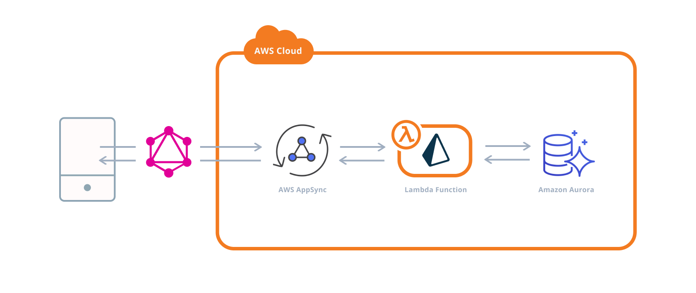

# CDK API with GraphQL and Aurora Serverless PostgreSQL and Prisma

This is a fork of a repo which was [livestreamed](https://youtu.be/pXd9BCwpjhA) by [Nader Dabit](https://twitter.com/dabit3) that is modified to use [Prisma](https://www.prisma.io/).

## Warning: The stack is not free

This stack will not come under the free tier. To delete all resources after you're done, use the following command:

```sh
yarn cdk destroy --profile profileName
```

Where the `profileName` is your AWS profile name. I have used `prisma_demo` here but you can replace that with any profile.

This CDK stack deploys a real-time GraphQL API built with AWS AppSync, Amazon Aurora Serverless PostgreSQL, AWS Lambda, and [Prisma](https://www.prisma.io/).



## Getting started

To deploy this project, follow these steps.

**1. Clone the project**

```sh
git clone https://github.com/ryands17/graphql-api-cdk-serverless-postgres.git
```

**2. Change into the new directory and install dependencies**

```sh
cd graphql-api-cdk-serverless-postgres
yarn
```

**3. Change into the _lambda-fns_ directory and install the dependencies for the Lambda function package:**

```sh
cd lambda-fns
yarn
cd ..
```

**4. Initialize `cdk.context.json` in the root directory with the following values (The account ID should match the one you're deploying to)**

```json
{
  "region": "us-east-1",
  "accountID": "123456789012",
  "keyName": "sshKeyName"
}
```

**5. Deploy the stack**

**_Note_**: I have deployed using an AWS Profile named `default`. To use your own profile, add the `profile` option after the deploy command like this:

```
yarn deploy --profile profile_name
```

Learn more about how to create an AWS profile [here](https://docs.aws.amazon.com/cli/latest/userguide/cli-configure-quickstart.html).

```sh
yarn deploy
```

**6. Create the posts table**

Visit the [RDS dashboard](https://console.aws.amazon.com/rds/home) and click on **Query Editor**. From the dropdown menu, choose the database (it should begin with **appsynccdkrdsstack-aurorablogcluster**).

For the Database username, choose **Connect with a Secrets Manager ARN**.

To sign in, you will need the ARN from the secret that was created by CDK. To get this secret, in a new window open [AWS Secrets manager](https://console.aws.amazon.com/secretsmanager/home). Here, click on the secret that was created by CDK (it should start with **AuroraBlogClusterSecret**). Copy the Secret ARN to your clipboard and go back to the RDS Query Editor.

Next, use the **Secret ARN** as the **Secrets Manager ARN** and **BlogDB** as the name of the database. Next, press enter and click on Connect to Database.

Once signed in, create the **posts** table by executing the following query:

```sql
create table posts (
 id text primary key,
 title text,
 content text
);
```

**7. Testing the API**

Next, visit the [AppSync console](https://console.aws.amazon.com/appsync/home) and click on **cdk-blog-appsync-api** to view the dashboard for your API.

Next click on **Queries** in the left hand menu to view the query editor. From here, we can test out the API by running the following queries and mutations:

```graphql
mutation createPost {
  createPost(
    post: { id: "001", title: "My first post!", content: "Hello world!" }
  ) {
    id
    title
    content
  }
}

query listPosts {
  listPosts {
    id
    title
    content
  }
}

query getPostById {
  getPostById(postId: "001") {
    id
    title
    content
  }
}

mutation updatePost {
  updatePost(post: { id: "001", title: "My updated post!" }) {
    id
    title
  }
}

mutation deletePost {
  deletePost(postId: "001")
}
```
